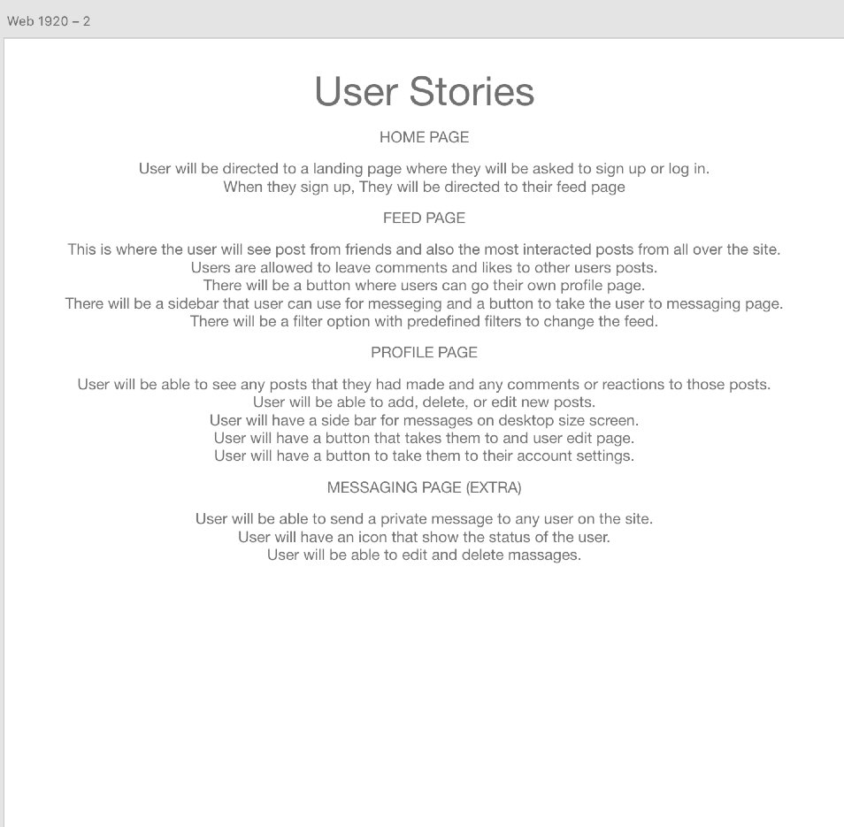
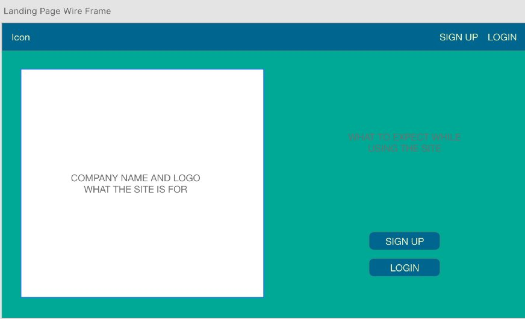
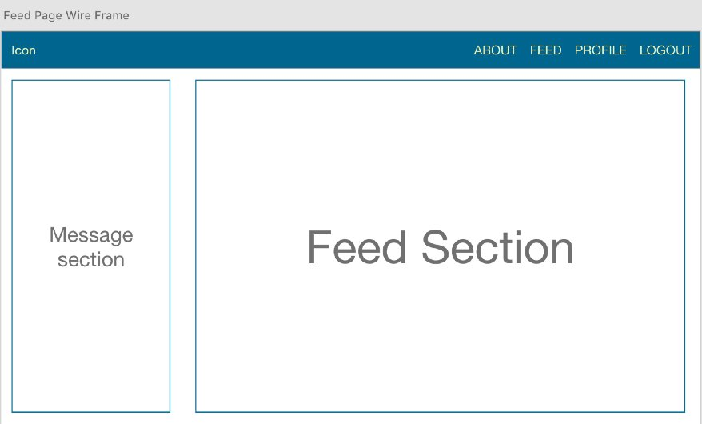
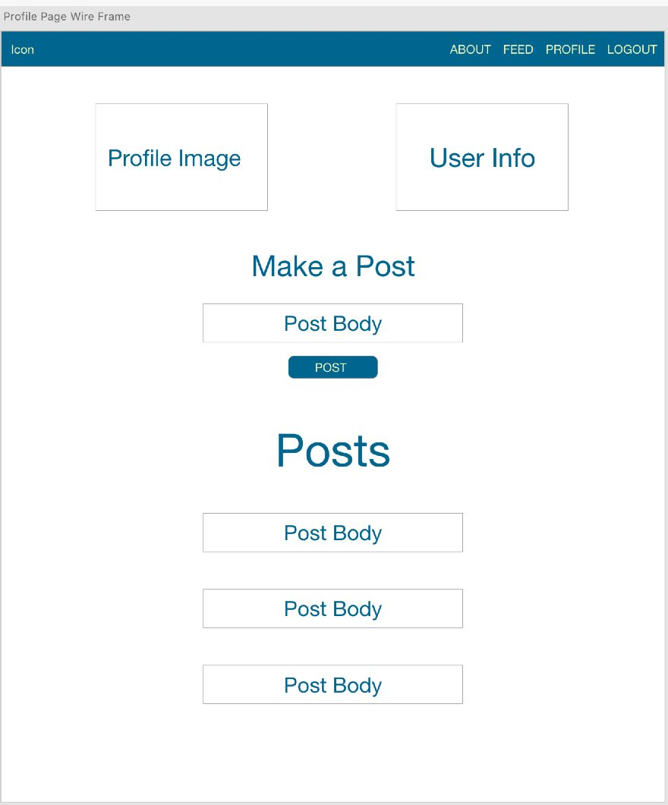
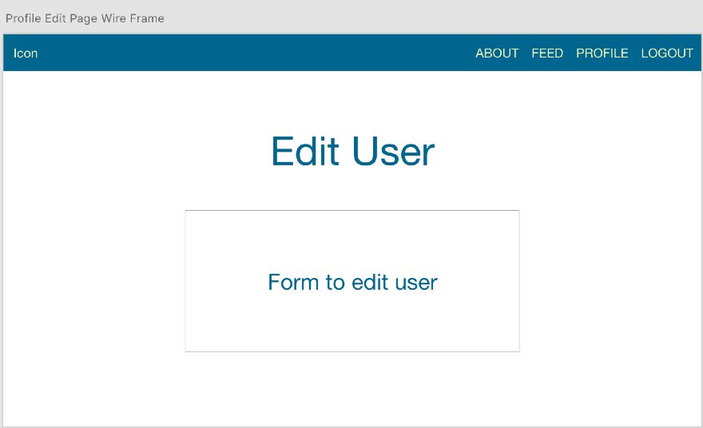
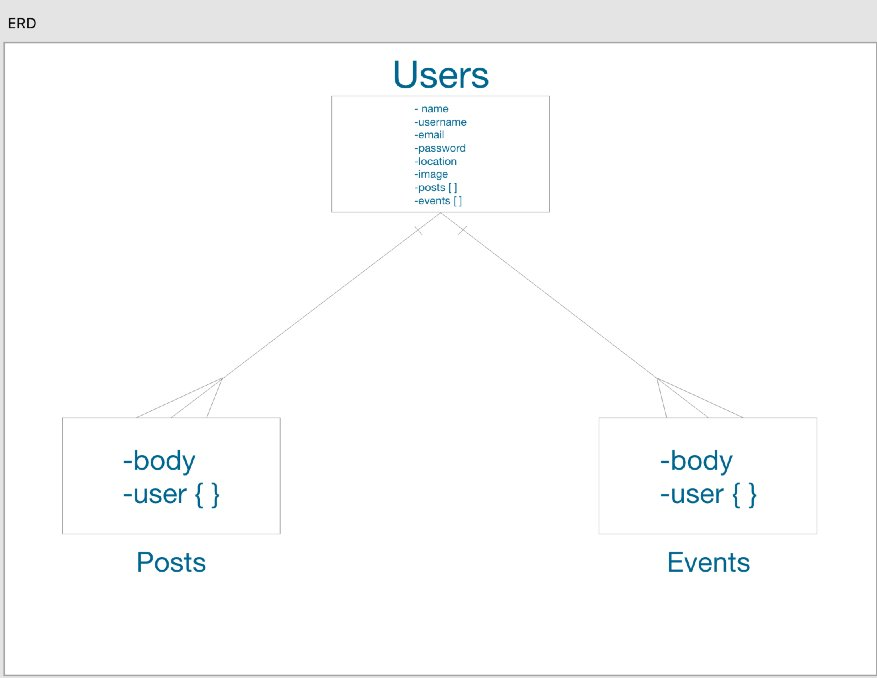

<h1 align="center">BandMates</h1>

## Description
#

BandMates is a social media app for musicians and music lovers who are looking for upcoming events and new music from other musicians. Users can connect to other musicians all around the world and share their experiences and love for music.

## Technologies
#

BandMates was built using the MERN stack.

* MongoDB 
* Express
* React
* Nodejs
* Mongoose
* React Router
* Bootstrap

## Installation
#

1. Make sure you have mongodb installed on your machine and a database named final-project created.

2. Clone down the back-end portion of the app - https://github.com/jpardike/final-project-server

3. Move into that directory in your terminal and run - npm i - to install any dependencies.

4. Move out of the server directory in your terminal and clone down the front-end portion of the app - https://github.com/jpardike/final-project-client

5. Move into the newly created front-end directory and run - npm i - to install the dependencies for the front-end.

6. Have to terminals open, one in the front-end directory and another in the back-end directory.

7. In the front-end terminal run - npm start - this will run the front-end at localhost:3000 in your browser.

8. In the back-end terminal run - nodemon server.js - this will run the back-end at localhost:4000 in your browser.

9. With both servers now running, the front-end and the back-end are now communicating and you can start coding!

## User Stories
#

## Wire Frames
#

Landing Page

Feed Page

User Profile Page

User Edit Page

## ERD
#

## Future Features
#

I plan on making this a much more finished product by adding auth, notifications, messaging, a search function and allowing users to make friends, and groups.